# DocAI – Document AI That *Thinks Before It Answers*

>       

---

## 🚀 What is DocAI?

**DocAI** transforms any document into your **personal research assistant** that *understands context before answering*. No login, no database, pure production-grade AI power.

- 📁 **Zero Auth**: Direct "Start Now" → Upload → Ask
- 🧠 **Smart Flow**: Upload → **Stays** on Summary → Manual Ask
- 🎨 **Pro Glassmorphism**: Production UI that scales
- ⚡ **Production Ready**: Railway + Vercel + Groq stack

> 💡 Your PDFs become interactive knowledge bases. Ask anything, get precise answers.

---

## 🎯 Why DocAI?

Document analysis is broken:
- **Manual reading** = hours wasted
- **ChatGPT limits** = loses context  
- **Enterprise tools** = $100+/month
- **Poor UIs** = nobody uses them

**DocAI's Mission**: Production-grade document AI that's **free to deploy, zero-config, and beautiful**.

---

## 🔗 Demos & Links

- **Live Frontend** → [DocAI.vercel.app](https://your-docai.vercel.app/)
- **Backend API** → [Railway.app](https://web-production-3de88.up.railway.app)
- **Full Source** → [GitHub Repo](https://github.com/yourusername/docai)
- **Deploy Guide** → [1-click Vercel](https://vercel.com/new/git/external)

---

## 📸 Screenshots & Demo Flow

|  |  |  |
|---|---|---|
| **Glassmorphism Landing** | **Zero-Auth Upload** | **Stays on Summary** |

|  |  |
|---|---|
| **Context-Aware Q&A** | **Slide-up Mobile** |

---

## ⚙️ How DocAI Works

### 🧭 System Architecture

```mermaid
graph TD
  A[📁 User Uploads PDF] --> B[FastAPI /upload]
  B --> C[Text Extraction]
  C --> D[FastAPI /summary]
  D --> E[Groq Llama3.1]
  E --> F[📋 Smart Summary]
  F --> G[Manual → /ask]
  G --> H[Context-Aware Answer]
```

Step-by-Step Magic

| Step | Endpoint     | What Happens                  |
| ---- | ------------ | ----------------------------- |
| 1    | POST /upload | FormData(file) → Extract text |
| 2    | GET /summary | Stays on summary page         |
| 3    | POST /ask    | FormData(question) → Groq AI  |

🛠️ Tech Stack
| Tech          | Role                       | Deployment |
| ------------- | -------------------------- | ---------- |
| FastAPI       | /upload /summary /ask      | Railway    |
| Groq Llama3.1 | Context-aware document Q&A | API        |
| HTML/CSS/JS   | Glassmorphism + State      | Vercel     |
| FormData      | Zero-CORS file upload      | Edge       |
| PyMuPDF       | PDF → Clean text           | Railway    |

🔌 Core Backend Logic

# FastAPI Endpoints (Railway)
@app.post("/upload")
async def upload(file: UploadFile):
    text = extract_text(file)  # PyMuPDF
    return {"status": "ready"}

@app.get("/summary")
async def summary():
    summary = groq.chat("summarize: " + text)
    return {"summary": summary}

@app.post("/ask")
async def ask(question: str = Form(...)):
    context = f"Document: {text}\nQ: {question}"
    answer = groq.chat(context)
    return {"answer": answer}

🧠 Frontend Flow (Fixed!)

// PERFECT 3-STEP FLOW
1. Landing → "Start Now" (No login)
2. Upload → STAYS on upload  
3. Summary → Manual "Ask Questions"
4. FormData POST /ask ✅ No 422 errors

🎯 Challenges Solved

| Problem         | Solution                           |
| --------------- | ---------------------------------- |
| 422 Errors      | FormData(question) instead of JSON |
| Auto-navigation | Manual Summary → Ask flow          |
| Groq Connection | Railway env: GROQ_API_KEY          |
| Mobile UX       | Slide-up sidebar + touch inputs    |
| CORS            | FastAPI middleware + Vercel edge   |

 Let's Connect!
🛠️ GitHub – Fork, star, contribute

📧 Email – Collab opportunities

🌍 Portfolio – More projects
