text
# DocAI – Document AI That *Thinks Before It Answers*

>  
>  
>  
> 
>  
>  
> 

<div align="center">

</div>

---

## 🚀 **What is DocAI?**

**DocAI** transforms PDFs into your **personal research assistant** with zero login, production-grade UI, and smart AI flow.

📁 Landing → "Start Now" → Upload → Summary → Manual Ask
🎨 Glassmorphism UI + Mobile sidebar
⚡ FastAPI + Groq + Railway/Vercel stack

text

> 💡 **Upload any PDF → Ask anything → Get precise context-aware answers**

---

## 🎯 **Why DocAI?**

| ❌ **Problems** | ✅ **DocAI Solution** |
|----------------|---------------------|
| Manual PDF reading (hours wasted) | 3-click AI analysis |
| ChatGPT forgets context | Document-aware Groq |
| Enterprise tools ($100+/mo) | **Free to deploy** |
| Ugly developer UIs | **Glassmorphism pro** |

---

## 🔗 **Live Demos**

Frontend: (https://doc-ai-six-mu.vercel.app/)
GitHub: https://github.com/mightynawiin/DocAI

text

---

## 📸 **Demo Flow**

|  |  |  |
|---|---|---|

---

## 🏗️ **Architecture**

```mermaid
graph LR
  A[📱 Vercel Frontend] -->|FormData| B[🚂 Railway FastAPI]
  B --> C[PyMuPDF Text Extraction]
  B --> D[🧠 Groq Llama3.1]
  D --> E[📋 Summary + Q&A]
```


<div align="center">

# 🧠 **DocAI Technical Blueprint**

</div>

## 🔌 **3 Perfect Endpoints**

| Endpoint | Method | Payload | Response |
|----------|--------|---------|----------|
| `/upload` | `POST` | `FormData(file)` | `{"status": "ready"}` |
| `/summary` | `GET` | None | `{"summary": "..."}` |
| `/ask` | `POST` | `FormData(question)` | `{"answer": "..."}` |

---

## 🛠️ **Tech Stack**

| Layer | Technology | Deployment | Purpose |
|-------|------------|------------|---------|
| 🎨 **Frontend** | HTML/CSS/JS | **Vercel** | Glassmorphism + State |
| ⚡ **Backend** | **FastAPI** | **Railway** | 3x Endpoints |
| 🧠 **AI** | **Groq Llama3.1** | API | Context Q&A |
| 📄 **Files** | PyMuPDF | Railway | PDF → Text |

---

## 💻 **Core Backend Code (FastAPI)**

```python
@app.post("/upload")
async def upload(file: UploadFile):
    text = extract_text(file)  # PyMuPDF
    return {"status": "ready"}

@app.get("/summary")
async def summary():
    summary = groq.chat("summarize: " + text)
    return {"summary": summary}
```

// PERFECT 3-STEP FLOW ✅
1. Landing → startApp()      // No login needed
2. upload() → STAYS upload    // FormData POST
3. getSummary() → STAYS summary // Manual control  
4. ask() → FormData /ask     // No 422 errors

🎯 Production Problems Solved
| 🐛 Issue        | ✅ Solution                  |
| --------------- | --------------------------- |
| 422 Errors      | FormData(question) not JSON |
| Auto-navigation | Manual Summary→Ask flow     |
| Groq Connection | GROQ_API_KEY in Railway     |
| Mobile UX       | Slide-up sidebar + touch    |
| CORS Blocks     | FastAPI middleware          |


<div align="center">

## 🙌 **Thank You!**

**DocAI** is now **production-ready** 🚀

